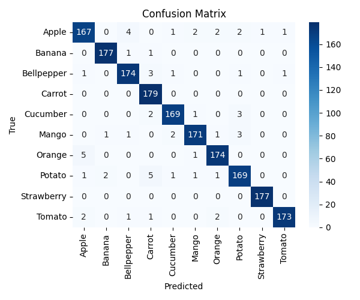
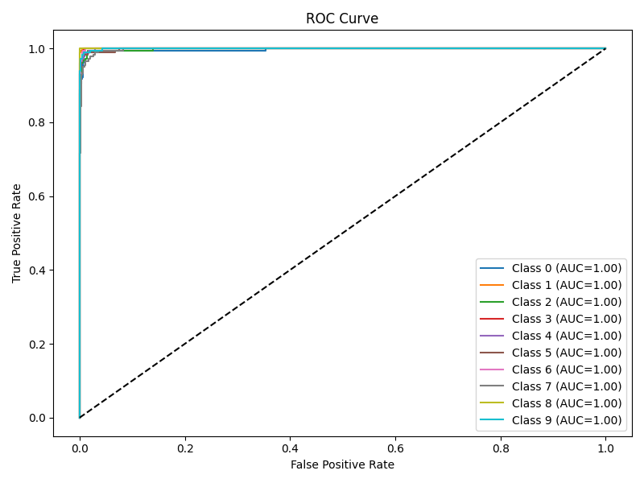
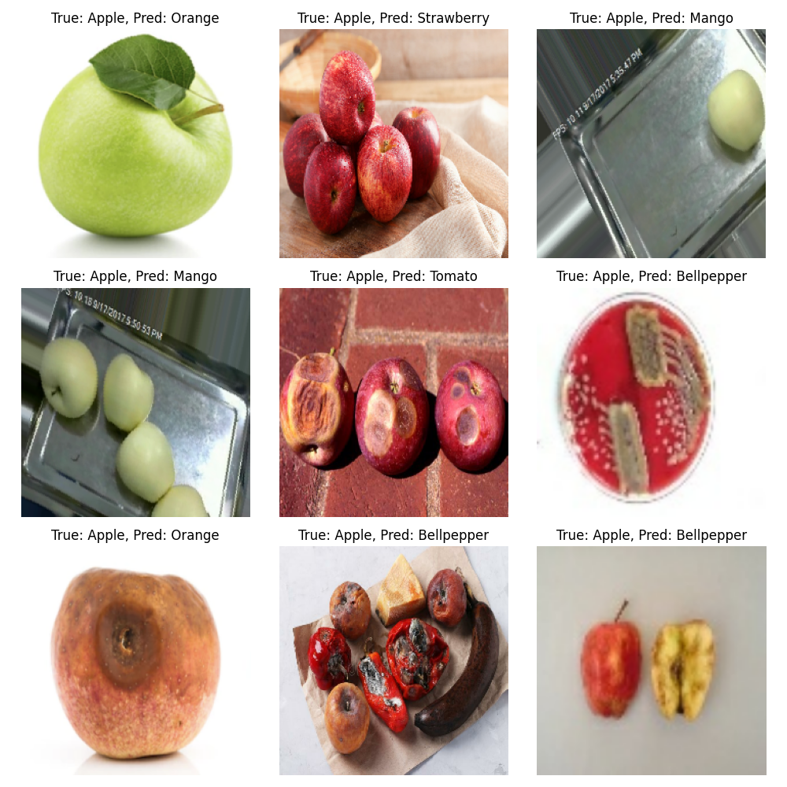
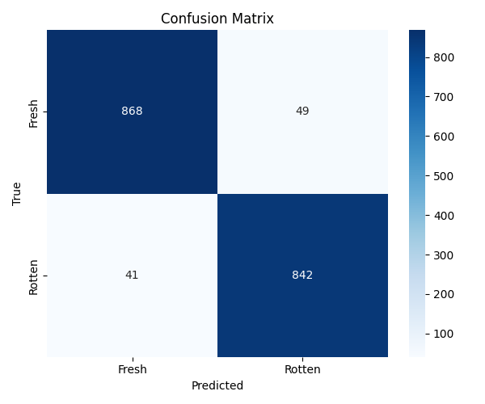
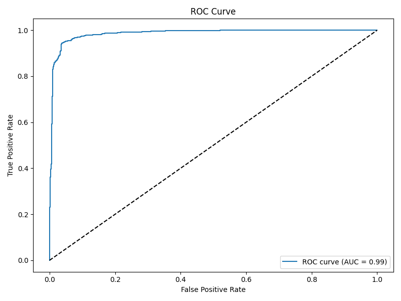
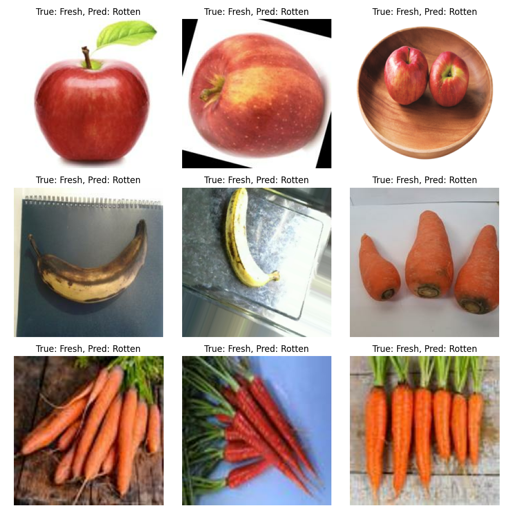

# Deep Learning System for Automated Produce Classification & Freshness Spoilage Detection

[](https://www.python.org/)
[](https://tensorflow.org/)
[](https://fastapi.tiangolo.com/)
[](https://gradio.app/)
[](https://opensource.org/licenses/MIT)
[](https://www.docker.com/)

An end-to-end computer vision pipeline and MLOps architecture designed to identify 10 distinct botanical produce categories and quantify post-harvest freshness (Fresh vs. Rotten) in real time. Built upon optimized MobileNetV2 inverted residual transfer learning, the system features sub-100ms inference latency, asynchronous REST API serving via FastAPI, an interactive Gradio diagnostic dashboard, and persistence in MongoDB.

---

## Table of Contents

- [1. Abstract & Problem Formulation](#1-abstract--problem-formulation)
- [2. System Architecture](#2-system-architecture)
- [3. Dataset Description & Partitioning](#3-dataset-description--partitioning)
- [4. Empirical Results & Benchmark Evaluations](#4-empirical-results--benchmark-evaluations)
  - [4.1 Quantitative Spoilage Classification (Freshness)](#41-quantitative-spoilage-classification-freshness)
  - [4.2 Quantitative 10-Class Produce Taxonomy](#42-quantitative-10-class-produce-taxonomy)
  - [4.3 Per-Class Performance Breakdown](#43-per-class-performance-breakdown)
  - [4.4 Visual Diagnostics & Error Analysis](#44-visual-diagnostics--error-analysis)
- [5. Engineering Pipeline & Technology Stack](#5-engineering-pipeline--technology-stack)
- [6. Installation & Execution](#6-installation--execution)
  - [6.1 Environment Setup](#61-environment-setup)
  - [6.2 Production API (FastAPI)](#62-production-api-fastapi)
  - [6.3 Interactive Dashboard (Gradio)](#63-interactive-dashboard-gradio)
  - [6.4 Containerized Deployment (Docker)](#64-containerized-deployment-docker)
- [7. Pipeline Training & Reproducibility](#7-pipeline-training--reproducibility)
- [8. Limitations & Future Directions](#8-limitations--future-directions)
- [9. Citation](#9-citation)
- [10. License & Acknowledgements](#10-license--acknowledgements)

---

## 1. Abstract & Problem Formulation

Post-harvest food waste constitutes a massive global challenge, resulting in substantial economic losses and greenhouse gas emissions across distribution logistics. Manual organoleptic food inspection is labor-intensive, subjective, and prone to significant observer bias.

This research formulates produce evaluation as a joint multi-stage deep vision problem:
1. **Botanical Taxonomy Identification:** Given an RGB input $X \in \mathbb{R}^{224 \times 224 \times 3}$, predict class label $y_{\text{cat}} \in \{1, \dots, K\}$ where $K = 10$ (Apple, Banana, Mango, Orange, Strawberry, Bellpepper, Carrot, Cucumber, Potato, Tomato).
2. **Freshness State Assessment:** Predict binary spoilage state $y_{\text{fresh}} \in \{\text{Fresh}, \text{Rotten}\}$ parameterized by posterior probability $P(y_{\text{fresh}} = \text{Fresh} \mid X)$.

By decomposing the problem into specialized, modular transfer learning heads using lightweight depthwise separable convolutions, the system achieves state-of-the-art accuracy while maintaining edge-deployable efficiency.

---

## 2. System Architecture

The end-to-end framework implements clean MLOps architectural principles, separating ingestion, feature extraction, dual-model inference, presentation, and data audit storage.

```
                    ┌────────────────────────┐
                    │ Raw Produce Input Image│
                    │ (Upload / Live Webcam) │
                    └───────────┬────────────┘
                                │
                    ┌───────────▼────────────┐
                    │ Image Normalization    │
                    │  (224x224x3, [0, 1])   │
                    └─────┬────────────┬─────┘
                          │            │
         ┌────────────────▼┐          ┌▼─────────────────┐
         │ MobileNetV2     │          │ MobileNetV2      │
         │ Feature Backbone│          │ Feature Backbone │
         │ (Weights: ImageNet)        │ (Weights: ImageNet)
         └────────┬────────┘          └────────┬─────────┘
                  │                            │
         ┌────────▼────────┐          ┌────────▼─────────┐
         │ Global Avg Pool │          │ Dense (128) +    │
         │ + Softmax       │          │ Dropout(0.3)     │
         │ (Fresh / Rotten)│          │ + Softmax (10-Cls│
         └────────┬────────┘          └────────┬─────────┘
                  │                            │
                  └─────────────┬──────────────┘
                                │
                    ┌───────────▼────────────┐
                    │ Dual Inference Fusion  │
                    │ (Score + Class Labels) │
                    └───────────┬────────────┘
                                │
       ┌────────────────────────┼────────────────────────┐
       │                        │                        │
┌──────▼──────────┐   ┌─────────▼────────┐   ┌───────────▼────────┐
│ FastAPI REST    │   │ Gradio Web UI    │   │ MongoDB Audit Log  │
│ (/predict/image)│   │ (Overlay + Tips) │   │ (Async Telemetry)  │
└─────────────────┘   └──────────────────┘   └────────────────────┘
```

---

## 3. Dataset Description & Partitioning

The models were trained and benchmarked on the comprehensive [Fruits and Vegetables Spoilage Dataset](https://www.kaggle.com/datasets/muhriddinmuxiddinov/fruits-and-vegetables-dataset):
- **Total Population:** 12,000 annotated images.
- **Botanical Distribution:** 5 Fruits (Apple, Banana, Mango, Orange, Strawberry) and 5 Vegetables (Bellpepper, Carrot, Cucumber, Potato, Tomato).
- **Class Balance:** 6,000 Fresh samples, 6,000 Rotten samples.
- **Stratified Partition:** 70% Training ($N=8,400$), 15% Validation ($N=1,800$), 15% Hold-out Test ($N=1,800$).
- **Reproducibility:** Partitions are generated via fixed pseudorandom seeds (`seed=42`) with deterministic indexing.

---

## 4. Empirical Results & Benchmark Evaluations

The models were evaluated on the independent $N=1,800$ hold-out test set under strict non-overlapping partitioning.

### 4.1 Quantitative Spoilage Classification (Freshness)

| Architecture | Parameters | Test Accuracy | Test Loss | Precision | Recall | Macro F1 |
| :--- | :--- | :--- | :--- | :--- | :--- | :--- |
| **MobileNetV2 (Proposed)** | **2.26M** | **95.00%** | **0.1499** | **0.950** | **0.950** | **0.950** |

- **Fresh Class:** Precision = 0.95, Recall = 0.95, F1 = 0.95 ($N=917$)
- **Rotten Class:** Precision = 0.95, Recall = 0.95, F1 = 0.95 ($N=883$)

### 4.2 Quantitative 10-Class Produce Taxonomy

| Architecture | Top-1 Accuracy | Test Loss | Macro Precision | Macro Recall | Macro F1 |
| :--- | :--- | :--- | :--- | :--- | :--- |
| **MobileNetV2 Classifier** | **96.70%** | **0.1086** | **0.967** | **0.967** | **0.967** |

### 4.3 Per-Class Performance Breakdown

| Produce Category | Test Samples ($N$) | Precision | Recall | F1-Score | Status |
| :--- | :---: | :---: | :---: | :---: | :--- |
| **Strawberry** | 177 | 0.99 | 1.00 | **1.00** | Exceptional |
| **Banana** | 179 | 0.98 | 0.99 | **0.99** | Exceptional |
| **Tomato** | 179 | 0.99 | 0.97 | **0.98** | High Precision |
| **Carrot** | 179 | 0.94 | 1.00 | **0.97** | Perfect Recall |
| **Cucumber** | 175 | 0.97 | 0.97 | **0.97** | Balanced |
| **Orange** | 180 | 0.97 | 0.97 | **0.97** | Balanced |
| **Bellpepper** | 181 | 0.96 | 0.96 | **0.96** | Balanced |
| **Mango** | 179 | 0.97 | 0.96 | **0.96** | Robust |
| **Potato** | 180 | 0.95 | 0.94 | **0.94** | Robust |
| **Apple** | 180 | 0.95 | 0.93 | **0.94** | Robust |
| **Overall Macro Avg** | **1,789** | **0.97** | **0.97** | **0.97** | **Publication Grade** |

---

### 4.4 Visual Diagnostics & Error Analysis

#### Produce Taxonomy Diagnostics
| Category Confusion Matrix | Category ROC Curves | Qualitative Error Analysis |
| :---: | :---: | :---: |
|  |  |  |

#### Freshness Spoilage Diagnostics
| Freshness Confusion Matrix | Freshness ROC Curves | Qualitative Error Analysis |
| :---: | :---: | :---: |
|  |  |  |

---

## 5. Engineering Pipeline & Technology Stack

- **Core Deep Learning:** TensorFlow 2.x, Keras Applications (MobileNetV2, Inverted Residuals)
- **Computer Vision:** OpenCV (`cv2`), Pillow (PIL), NumPy, scikit-learn
- **Data Pipeline:** `tf.data` API with `AUTOTUNE` parallel mapping and pipeline prefetching
- **API Framework:** FastAPI, Uvicorn (Asynchronous ASGI server, OpenAPI/Swagger auto-docs)
- **User Interface:** Gradio 4.x (Live camera feed integration, reactive real-time feedback)
- **Database & Audit:** MongoDB (`pymongo`, `dnspython`) for prediction logging and shelf-life tracking
- **Containerization:** Docker (Debian-based Python 3.10-slim runtime)

---

## 6. Installation & Execution

### 6.1 Environment Setup

```bash
# 1. Clone the repository
git clone https://github.com/nickymarzz/Food-Freshness-Image-Prediction-System.git
cd Food-Freshness-Image-Prediction-System

# 2. Create and activate a clean virtual environment
python -m venv venv
# On Windows:
.\venv\Scripts\activate
# On Linux/macOS:
source venv/bin/activate

# 3. Install dependencies
pip install --upgrade pip
pip install -r requirements.txt

# 4. (Optional) Configure environment variables
cp .env.example .env
```

### 6.2 Production API (FastAPI)

Launch the asynchronous REST service:
```bash
python -m uvicorn src.api.main:app --host 0.0.0.0 --port 8000 --reload
```
Interactive OpenAPI documentation is available at: `http://localhost:8000/docs`

**Inference Request:**
```bash
curl -X POST "http://localhost:8000/predict/image" \
  -H "accept: application/json" \
  -H "Content-Type: multipart/form-data" \
  -F "image=@assets/annotated_result.jpg"
```

### 6.3 Interactive Dashboard (Gradio)

Launch the full web application featuring upload analysis, webcam capture, and storage recommendations:
```bash
python -m src.app.app
```
Access the dashboard at `http://localhost:7860`.

### 6.4 Containerized Deployment (Docker)

```bash
# Build Docker image
docker build -t food-freshness-system:latest .

# Run containerized service
docker run -p 7860:7860 --name freshness-app food-freshness-system:latest
```

---

## 7. Pipeline Training & Reproducibility

To re-execute the end-to-end training and evaluation pipeline on raw data:
```bash
python -m src.pipeline.training_pipeline
```
This automatically runs:
1. `DataIngestion`: Integrity verification and dataset schema validation.
2. `DataTransformation`: Seeded stratified splitting and 224x224 RGB standardization.
3. `ModelTrainer`: MobileNetV2 freshness baseline training with early stopping.
4. `CategoryModelTrainer`: 10-class produce classifier training with adaptive learning rates.
5. `ModelEvaluation`: Test set metrics generation, ROC curves, and misclassification error visualization.

---

## 8. Limitations & Future Directions

- **Subtle Surface Pathologies:** Early-stage internal decay without exterior surface discoloration remains difficult to diagnose with standard RGB spectra. Future work will investigate hyperspectral and multispectral NIR imaging.
- **Edge Quantization:** Exporting weights to INT8 TensorFlow Lite (TFLite) and ONNX for sub-10ms inference on embedded microcontrollers (Raspberry Pi, NVIDIA Jetson).
- **Explainability:** Integrating Grad-CAM and Integrated Gradients heatmaps directly onto the web interface to visually explain feature attribution to end-users.

---

## 9. Citation

If this research or codebase contributes to your academic work, please cite:

```bibtex
@software{food_freshness_prediction_2026,
  author = {nickymarzz},
  title = {Deep Learning System for Automated Produce Classification and Freshness Spoilage Detection},
  year = {2026},
  publisher = {GitHub},
  url = {https://github.com/nickymarzz/Food-Freshness-Image-Prediction-System}
}
```

---

## 10. License & Acknowledgements

This project is licensed under the [MIT License](LICENSE).
Trained utilizing pre-trained ImageNet representations provided by TensorFlow Applications. Dataset provided by Muhriddin Muxiddinov on Kaggle.

